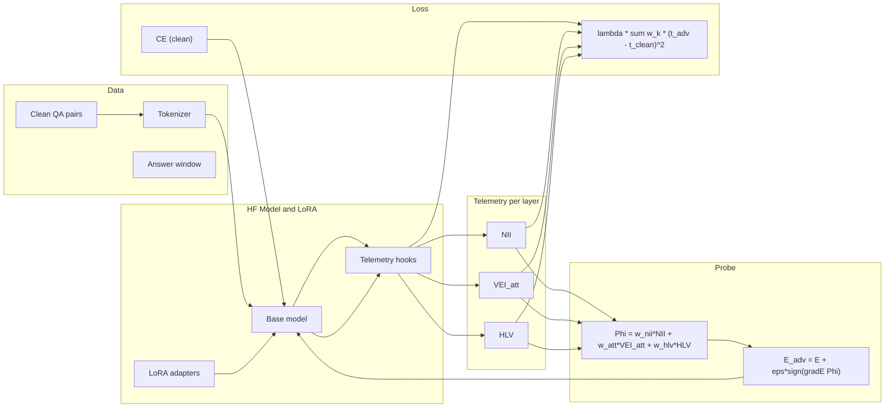
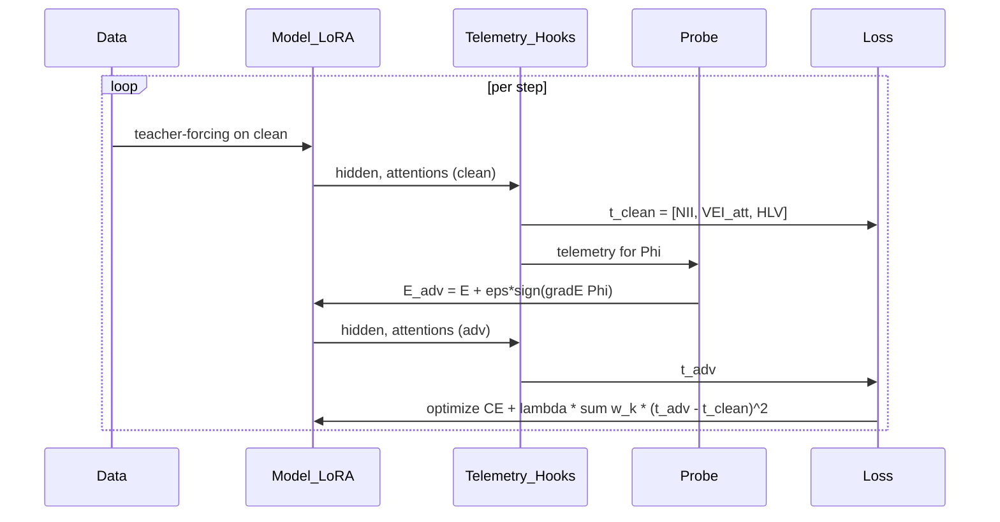

## JOLT: Implementation Summary, Progress, and Rationale

### 1) What we built (at a glance)
- Detector-agnostic training that suppresses hallucination detector telemetry using LoRA.
- Metrics per layer on the answer-only token window:
  - NII: residual–attention misalignment.
  - VEI_att: attention kernel spread.
  - HLV (new): hidden log-volume = log det((1/m) X Xᵀ + εI) with token centering.
- Probe (FGSM) excites these metrics; loss matches adversarial back to clean per layer, using weights.

Key files:
- `jolt/telemetry.py` (HLV added, numerically safe; centered; with fallbacks)
- `jolt/train.py` (uses `hid_logvol` in probe + loss; logging/CSV updated)
- `jolt/loss.py` (per-key weights; clean handling)
- `configs/jolt_llama.yaml` (weights, head sampling, etc.)
- `jolt/plot_telemetry.py` (plots include `hid_logvol` clean/adv/delta)

### 2) Why it works
- LLM-Check’s hidden branch separates classes via the layerwise log-volume of answer-token representations (after centering across tokens).
- We directly target that cause: the probe increases hidden log-volume differences; the loss enforces invariance (adv ≈ clean) per layer, shrinking the detector’s separability.
- Attention suppression remains effective because LoRA on Q/K/V directly reshapes attention kernels; VEI_att matching reduces their spread variance across samples.

### 3) Architecture (updated)


### 4) Training loop (sequence)


### 5) Implementation details (HLV)
- Token-centered covariance: Zc = Z − mean_rows(Z); C = (Zc Zcᵀ)/m + εI.
- Numerics: symmetrization + magnitude-aware jitter; fallback clamp if slogdet unstable.
- Head sampling for attention: `telemetry.head_sample: 0` averages all heads.

### 6) Current config (key)
```yaml
loss:
  lambda_: 0.5
  weights:
    hid_logvol: 1.0
    vei_att: 1.0
    nii: 0.5
    vei_hid: 0.0
telemetry:
  head_sample: 0
adv:
  epsilon: 0.0005
train:
  max_steps: 500  # consider 1000–1500 next
```

### 7) Results (FAVA-annot, Llama‑2‑7B‑Chat, N=200, balanced)
- Mean ΔAUC (adapted − baseline):
  - Attention: −0.106
  - Hidden: −0.074
  - Logits: perplexity −0.044, window_entropy −0.068, logit_entropy −0.029
- Per-layer deltas: consistent drops across many deep layers (hidden and attention).
- Artifacts:
  - Text: see `logs/jolt-train.out`, `logs/llm-check.out`.
  - CSV/plots: `logs/jolt_telemetry.csv`, `logs/jolt_delta_hid_logvol_heatmap.png`, `logs/jolt_delta_vei_att_heatmap.png`, `logs/jolt_layer_mean_clean_adv.png`.

### 8) Why we improved vs earlier attempt
- Earlier hidden proxy used uncentered X Xᵀ, letting the probe exploit mean shifts (detector centers tokens). Switching to centered HLV aligned with the detector and removed the artifact.
- Added numeric stabilization to avoid -inf/NaNs in long windows.
- Reduced hidden weight to prevent domination; attention and hidden now co-move to reduce separability.

### 9) How to reproduce
1. Train:
```bash
sbatch /common/home/users/m/myatmin.nay.2022/HalluRed/sbatch_jolt.sh
```
2. Baseline and adapted scores:
```bash
sbatch --export=ALL,MODEL=llama,DATASET=fava_annot,N_SAMPLES=200,MT_LIST="logit hidden attns",USE_TOKLENS=1 \
  /common/home/users/m/myatmin.nay.2022/HalluRed/sbatch_run.sh
sbatch --export=ALL,MODEL=llama,DATASET=fava_annot,N_SAMPLES=200,MT_LIST="logit hidden attns",USE_TOKLENS=1,\
ADAPTER_DIR=/common/home/users/m/myatmin.nay.2022/HalluRed/checkpoints/meta-llama_Llama-2-7b-chat-hf \
  /common/home/users/m/myatmin.nay.2022/HalluRed/sbatch_eval.sh
```
3. Metrics & plots:
```bash
python -m jolt.eval_scores --scores_pkl data/scores_fava_annot_llama_200samp.pkl --balanced --print_layerwise
python -m jolt.eval_scores --scores_pkl data/scores_fava_annot_llama_200samp_adapter.pkl --balanced --print_layerwise
python -m jolt.compare_scores --baseline_pkl data/scores_fava_annot_llama_200samp.pkl \
  --adapted_pkl data/scores_fava_annot_llama_200samp_adapter.pkl --balanced --print_layerwise --plot_dir logs --metric auc
```

### 10) Next steps
- Scale steps to 1000–1500 and monitor CE stability.
- Optionally increase `hid_logvol` weight to 1.2–1.5.
- Keep answer-only window; try adding a short early window for robustness checks.
- Confirm QA metrics (EM/F1/ppl) remain within tolerance.


